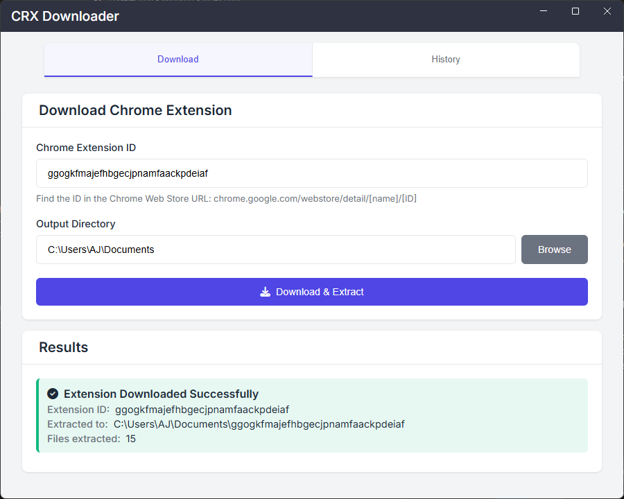
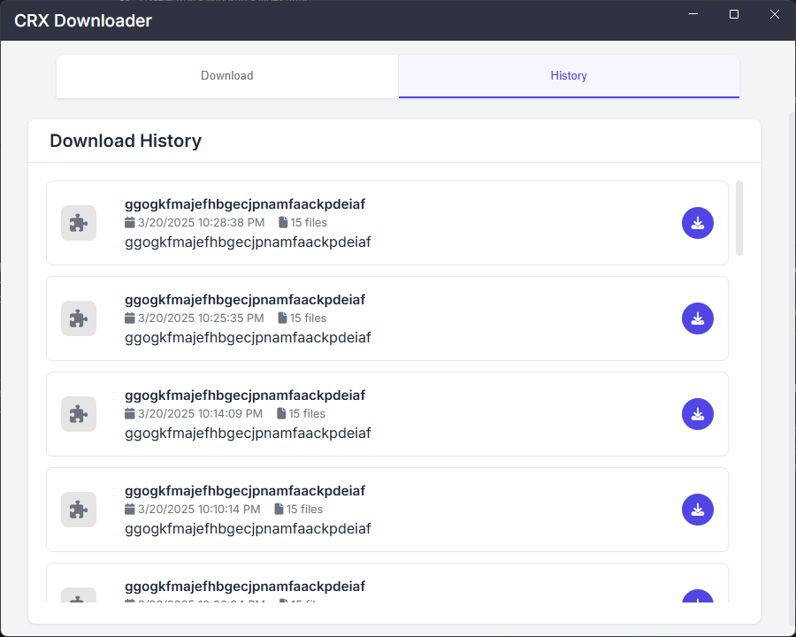

# Electron CRX Downloader 🔽

A modern Electron application for downloading and extracting Chrome extensions with a sleek user interface and history tracking.

## ✨ Features

- 📦 Download Chrome extensions using their IDs
- 🗂️ Extract extensions to specific directories
- 📝 Track download history with timestamps
- 🔄 One-click redownloading from history
- 🎨 Modern UI with custom title bar and tabs
- 💻 Cross-platform support
- 🚀 Fast extraction using AdmZip
- 🎯 Clean, responsive interface

## 📸 Screenshots

### Download Tab


### History Tab


## 🔧 Prerequisites

- Node.js (v14 or later)
- npm (v6 or later)

## 📥 Installation

Clone the repository and install dependencies:

```bash
git clone https://github.com/yourusername/crx-electron.git
cd crx-electron
npm install
```

## 🚀 Usage

Start the application:

```bash
npm start
```

Build the application:

```bash
npm run build
```

## 📖 How to Use

1. **Download a Chrome Extension:**
   - Enter a Chrome extension ID in the input field
   - Find the ID in the Chrome Web Store URL: `chrome.google.com/webstore/detail/[name]/[ID]`
   - Select an output directory using the "Browse" button
   - Click "Download & Extract"

2. **View Download History:**
   - Switch to the History tab
   - See all previously downloaded extensions with timestamps
   - Click the download icon to redownload any extension
   - History is automatically saved and persists between sessions

## 🛠️ Technical Features

- Modern tab-based navigation
- Persistent download history using localStorage
- Efficient file extraction with AdmZip
- Custom window controls (minimize, maximize, close)
- Responsive layout with proper scrolling
- Error handling and success notifications
- Clean, maintainable code structure

## 📚 Dependencies

- [Electron](https://www.electronjs.org/) - Desktop application framework
- [AdmZip](https://www.npmjs.com/package/adm-zip) - ZIP file management
- [electron-builder](https://www.electron.build/) - Package and build Electron apps
- [Font Awesome](https://fontawesome.com/) - Icons
- [Inter](https://fonts.google.com/specimen/Inter) - Modern typography

## 📄 License

ISC
